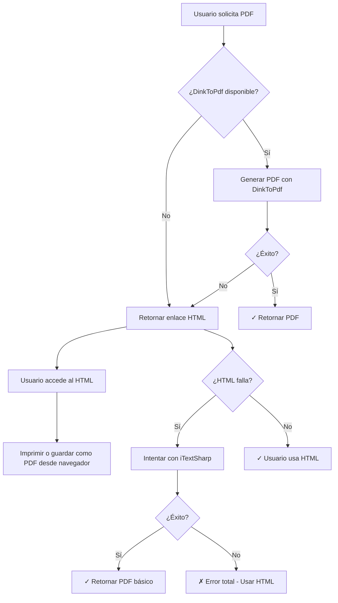

# API de Generación de PDFs y HTML

Esta API permite generar PDFs de remisiones para solicitudes de entrada, manteniendo la funcionalidad multicompañía. Incluye un sistema de fallback que genera HTML optimizado para impresión cuando la generación automática de PDF falla.

## Características Principales

- **Generación automática de PDF** usando DinkToPdf (preferido) o iTextSharp (fallback)
- **Fallback a HTML** cuando la generación de PDF falla
- **HTML optimizado para impresión** con botones y instrucciones integradas
- **Soporte multicompañía** con conexiones dinámicas a bases de datos
- **Parámetros configurables** para personalizar el contenido de la remisión

## Endpoints Disponibles

### 1. Generar PDF de Remisión (GET)

Genera un PDF de remisión para una solicitud de entrada específica. Si falla, retorna información sobre el fallback a HTML.

**URL:** `GET /api/Pdf/remision/{id}`

**Parámetros de Ruta:**
- `id` (int): ID de la solicitud de entrada

**Parámetros de Consulta:**
- `companyCode` (string, requerido): Código de la compañía
- `lot` (int, opcional): Imprimir lote (1: sí, 0: no). Default: 1
- `price` (int, opcional): Imprimir precio (1: sí, 0: no). Default: 1
- `code` (int, opcional): Imprimir código corto (1: sí, 0: no). Default: 0
- `duedate` (int, opcional): Imprimir fecha de vencimiento (1: sí, 0: no). Default: 1
- `option` (int, opcional): Imprimir solo lo despachado (1: sí, 0: no). Default: 0
- `regSan` (int, opcional): Imprimir registro sanitario (1: sí, 0: no). Default: 1
- `printMethod` (int, opcional): Método de impresión (0: flujo automático, 1: HTML, 2: iTextSharp). Default: 0

**Respuestas:**
- **200 OK**: Archivo PDF generado exitosamente
- **400 Bad Request**: Código de compañía faltante
- **404 Not Found**: Solicitud de entrada no encontrada
- **503 Service Unavailable**: PDF no pudo generarse, se proporciona enlace HTML como alternativa
- **500 Internal Server Error**: Error interno del servidor

**Ejemplo de Respuesta Exitosa (200):**
```
Content-Type: application/pdf
Content-Disposition: attachment; filename="Remision_P-123_20241201_143022.pdf"
[Archivo PDF binario]
```

**Ejemplo de Respuesta de Fallback (503):**
```json
{
  "error": "No se pudo generar el PDF automáticamente",
  "message": "No se pudo generar el PDF. Se puede usar la versión HTML como alternativa.",
  "fallback": {
    "type": "html",
    "url": "https://api.example.com/api/Pdf/remision/123/html?companyCode=COMP001&lot=1&price=1&code=0&duedate=1&option=0&regSan=1",
    "instructions": "Use el enlace HTML para imprimir o guardar como PDF desde el navegador"
  }
}
```

**Ejemplo de Uso:**
```http
GET /api/Pdf/remision/123?companyCode=COMP001&lot=1&price=1&code=0&duedate=1&option=0&regSan=1
```

### Métodos de Impresión Disponibles

El parámetro `printMethod` permite especificar qué método de generación usar:

| Valor | Método | Descripción |
|-------|--------|-------------|
| `0` | **Flujo Automático** (Default) | Sigue el flujo: DinkToPdf → HTML → iTextSharp |
| `1` | **HTML** | Fuerza la generación de HTML para impresión desde navegador |
| `2` | **iTextSharp** | Fuerza la generación con iTextSharp (PDF básico) |

#### Ejemplos de Uso por Método:

**Flujo Automático (Default):**
```http
GET /api/Pdf/remision/123?companyCode=COMP001&printMethod=0
```

**Forzar HTML:**
```http
GET /api/Pdf/remision/123?companyCode=COMP001&printMethod=1
```

**Forzar iTextSharp:**
```http
GET /api/Pdf/remision/123?companyCode=COMP001&printMethod=2
```

### 2. Generar PDF de Remisión (POST)

Genera un PDF de remisión para una solicitud de entrada específica usando POST.

**URL:** `POST /api/Pdf/remision`

**Cuerpo de la Solicitud:**
```json
{
  "entryRequestId": 123,
  "companyCode": "COMP001",
  "lot": 1,
  "price": 1,
  "code": 0,
  "dueDate": 1,
  "option": 0,
  "regSan": 1,
  "printMethod": 0
}
```

**Parámetros del Cuerpo:**
- `entryRequestId` (int, requerido): ID de la solicitud de entrada
- `companyCode` (string, requerido): Código de la compañía
- `lot` (int, opcional): Imprimir lote (1: sí, 0: no). Default: 1
- `price` (int, opcional): Imprimir precio (1: sí, 0: no). Default: 1
- `code` (int, opcional): Imprimir código corto (1: sí, 0: no). Default: 0
- `dueDate` (int, opcional): Imprimir fecha de vencimiento (1: sí, 0: no). Default: 1
- `option` (int, opcional): Imprimir solo lo despachado (1: sí, 0: no). Default: 0
- `regSan` (int, opcional): Imprimir registro sanitario (1: sí, 0: no). Default: 1
- `printMethod` (int, opcional): Método de impresión (0: flujo automático, 1: HTML, 2: iTextSharp). Default: 0

**Respuestas:** Igual que el endpoint GET.

### 3. Generar HTML de Remisión para Impresión (GET)

Genera HTML optimizado para impresión en navegador. Incluye botones de impresión y instrucciones integradas.

**URL:** `GET /api/Pdf/remision/{id}/html`

**Parámetros:** Igual que el endpoint de PDF GET.

**Respuesta:**
- **200 OK**: HTML optimizado para impresión
- **400 Bad Request**: Código de compañía faltante
- **404 Not Found**: Solicitud de entrada no encontrada
- **500 Internal Server Error**: Error interno del servidor

**Características del HTML generado:**
- ✅ Botón de impresión integrado
- ✅ Instrucciones de uso automáticas
- ✅ CSS optimizado para impresión
- ✅ Saltos de página automáticos
- ✅ Compatible con guardado como PDF desde navegador
- ✅ Responsive design

**Ejemplo de Uso:**
```http
GET /api/Pdf/remision/123/html?companyCode=COMP001&lot=1&price=1&code=0&duedate=1&option=0&regSan=1
```

### 4. Generar HTML de Remisión para Impresión (POST)

Genera HTML optimizado para impresión usando POST.

**URL:** `POST /api/Pdf/remision/html`

**Cuerpo de la Solicitud:** Igual que el endpoint de PDF POST.

**Respuesta:** Igual que el endpoint HTML GET.

## Flujo de Fallback

Cuando la generación automática de PDF falla, el sistema sigue este flujo optimizado:

### PASO 1: DinkToPdf (Método Preferido)
- **Objetivo**: Generar PDF con preservación completa del diseño visual
- **Condición**: DinkToPdf debe estar disponible y funcionando
- **Resultado**: Si es exitoso, retorna PDF inmediatamente
- **Si falla**: Procede al PASO 2

### PASO 2: HTML para Impresión desde Navegador
- **Objetivo**: Proporcionar alternativa inmediata al usuario
- **Acción**: Retorna error 503 con enlace al HTML optimizado
- **Ventajas**: 
  - No requiere librerías nativas
  - Permite al usuario imprimir o guardar como PDF desde el navegador
  - Mantiene la calidad visual del diseño original
- **Si falla**: Procede al PASO 3

### PASO 3: iTextSharp (Último Recurso)
- **Objetivo**: Garantizar que siempre se genere algún tipo de PDF
- **Condición**: Solo se ejecuta si los pasos anteriores fallan
- **Resultado**: PDF básico pero funcional
- **Limitaciones**: Puede perder algunos elementos de diseño visual

### Diagrama del Flujo



### Ventajas del Nuevo Flujo

1. **Prioridad al diseño visual**: DinkToPdf preserva completamente el diseño
2. **Alternativa inmediata**: HTML permite al usuario continuar sin esperar
3. **Flexibilidad del usuario**: Puede imprimir o guardar como PDF según sus necesidades
4. **Último recurso garantizado**: iTextSharp asegura que siempre haya una opción
5. **Mejor experiencia de usuario**: No hay tiempos de espera largos por fallos de librerías

## Uso del HTML para Impresión

### Instrucciones para el Usuario

1. **Acceder al HTML**: Use el enlace proporcionado en la respuesta de error 503
2. **Imprimir**: Haga clic en el botón "🖨️ Imprimir / Guardar PDF" o use Ctrl+P
3. **Guardar como PDF**: En la ventana de impresión, seleccione "Guardar como PDF" como destino
4. **Configuración recomendada**: A4, sin márgenes, escala 100%

### Características del HTML

- **Botón de impresión flotante**: Siempre visible en la esquina superior derecha
- **Instrucciones automáticas**: Se muestran al cargar la página y se ocultan automáticamente
- **CSS optimizado**: Estilos específicos para impresión que aseguran calidad profesional
- **Saltos de página inteligentes**: Evita cortar tablas o información importante
- **Compatibilidad**: Funciona en todos los navegadores modernos

## Códigos de Error

| Código | Descripción | Solución |
|--------|-------------|----------|
| 400 | Código de compañía faltante | Proporcionar el parámetro `companyCode` |
| 404 | Solicitud de entrada no encontrada | Verificar que el ID existe en la base de datos |
| 503 | PDF no pudo generarse | Usar el enlace HTML proporcionado en la respuesta |
| 500 | Error interno del servidor | Contactar al administrador del sistema |

## Ejemplos de Integración

### JavaScript (Fetch API)

```javascript
// Intentar generar PDF
async function generatePdf(entryRequestId, companyCode) {
    try {
        const response = await fetch(`/api/Pdf/remision/${entryRequestId}?companyCode=${companyCode}`);
        
        if (response.ok) {
            // PDF generado exitosamente
            const blob = await response.blob();
            const url = window.URL.createObjectURL(blob);
            const a = document.createElement('a');
            a.href = url;
            a.download = `Remision_P-${entryRequestId}.pdf`;
            a.click();
        } else if (response.status === 503) {
            // Fallback a HTML
            const errorData = await response.json();
            const htmlUrl = errorData.fallback.url;
            
            // Abrir HTML en nueva ventana
            window.open(htmlUrl, '_blank');
            
            // Mostrar mensaje al usuario
            alert('No se pudo generar el PDF automáticamente. Se abrirá la versión HTML para que pueda imprimirla.');
        } else {
            throw new Error(`Error ${response.status}: ${response.statusText}`);
        }
    } catch (error) {
        console.error('Error generando PDF:', error);
        alert('Error al generar el PDF. Intente nuevamente.');
    }
}
```

### C# (HttpClient)

```csharp
public async Task<byte[]> GeneratePdfAsync(int entryRequestId, string companyCode)
{
    using var client = new HttpClient();
    var url = $"https://api.example.com/api/Pdf/remision/{entryRequestId}?companyCode={companyCode}";
    
    var response = await client.GetAsync(url);
    
    if (response.IsSuccessStatusCode)
    {
        return await response.Content.ReadAsByteArrayAsync();
    }
    else if (response.StatusCode == System.Net.HttpStatusCode.ServiceUnavailable)
    {
        // Fallback a HTML
        var errorContent = await response.Content.ReadAsStringAsync();
        var errorData = JsonSerializer.Deserialize<ErrorResponse>(errorContent);
        
        // El usuario puede acceder al HTML usando errorData.Fallback.Url
        throw new PdfGenerationException($"PDF no disponible. Use HTML: {errorData.Fallback.Url}");
    }
    else
    {
        throw new HttpRequestException($"Error {response.StatusCode}: {response.ReasonPhrase}");
    }
}
```

## Notas Técnicas

### Dependencias Requeridas

- **DinkToPdf**: Para generación de PDF con preservación de diseño visual
- **iTextSharp**: Como método de fallback para generación de PDF
- **Entity Framework Core**: Para acceso a datos multicompañía

### Configuración de Librerías Nativas

Para que DinkToPdf funcione correctamente, asegúrese de que la librería nativa `libwkhtmltox.dll` esté disponible en uno de estos directorios:
- Directorio de la aplicación
- Directorio de trabajo actual
- Directorio raíz del contenido

### Optimización de Rendimiento

- El HTML se genera una sola vez y se optimiza para impresión
- Los estilos CSS están integrados para evitar dependencias externas
- El JavaScript es mínimo y se ejecuta solo cuando es necesario
- Las imágenes se optimizan automáticamente para impresión

## Soporte

Para problemas técnicos o preguntas sobre la implementación, contacte al equipo de desarrollo. 