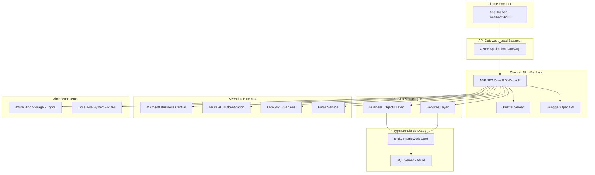
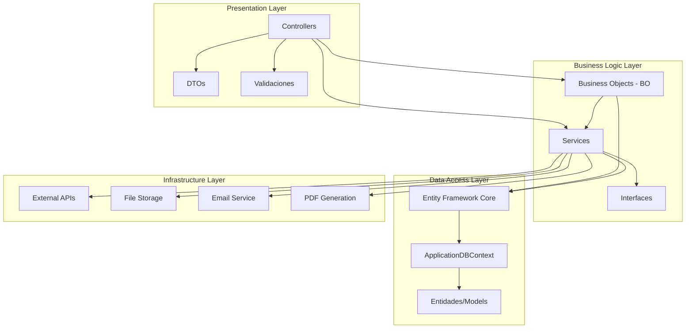
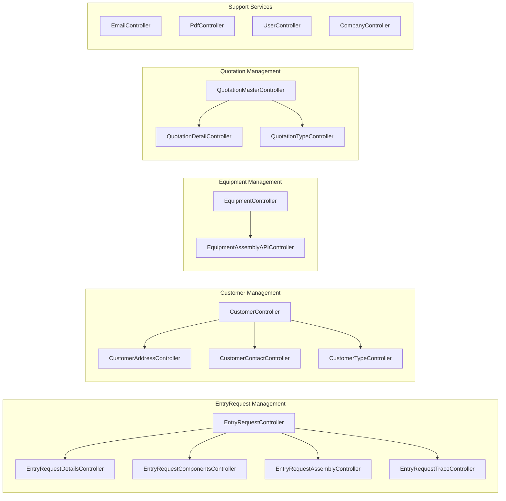
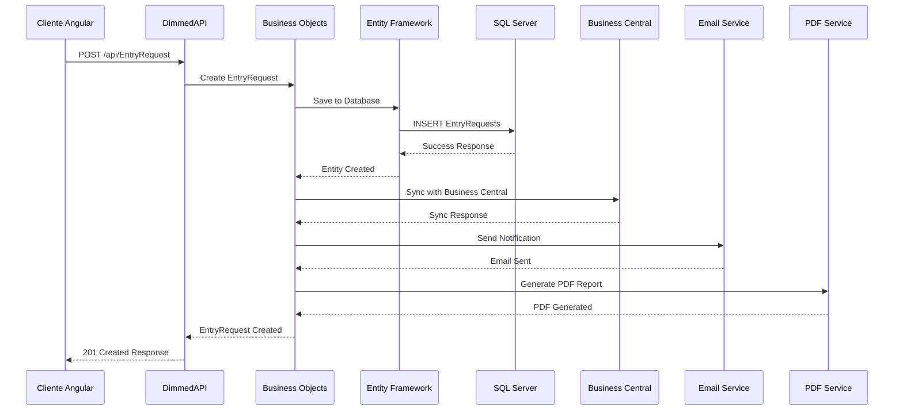
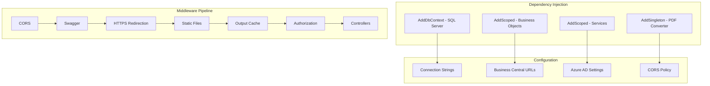
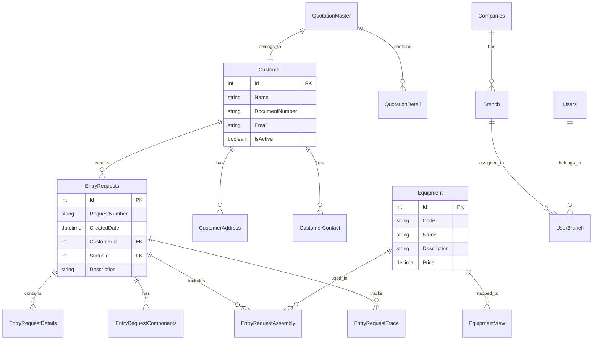

# Diagrama de Infraestructura - DimmedAPI

## Arquitectura General del Sistema

## Arquitectura de Capas

## Detalle de Controllers y Endpoints

## Flujo de Datos Principal

## Configuración de Servicios

## Modelo de Datos Principal

## Tecnologías y Versiones

| Componente | Tecnología | Versión |
|------------|------------|---------|
| **Backend Framework** | ASP.NET Core | 9.0 |
| **Database ORM** | Entity Framework Core | 9.0 |
| **Database** | SQL Server | Azure |
| **Authentication** | Azure AD | - |
| **PDF Generation** | DinkToPdf | - |
| **Containerization** | Docker | - |
| **API Documentation** | Swagger/OpenAPI | - |
| **External Integration** | Business Central API | v2.0 |
| **Email Service** | SMTP | - |
| **File Storage** | Azure Blob Storage | - |

## Configuraciones de Seguridad

- **CORS**: Configurado para permitir orígenes específicos
- **HTTPS**: Redirección forzada a HTTPS
- **Authentication**: Azure AD integration
- **Database**: Conexión encriptada a Azure SQL
- **API Keys**: Configuración segura para servicios externos

## Puntos de Integración

1. **Business Central**: Sincronización de datos comerciales
2. **CRM Sapiens**: Integración para pedidos
3. **Azure AD**: Autenticación y autorización
4. **Email Service**: Notificaciones automáticas
5. **PDF Service**: Generación de reportes
6. **File Storage**: Almacenamiento de logos y documentos
