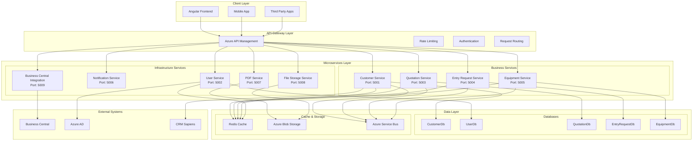
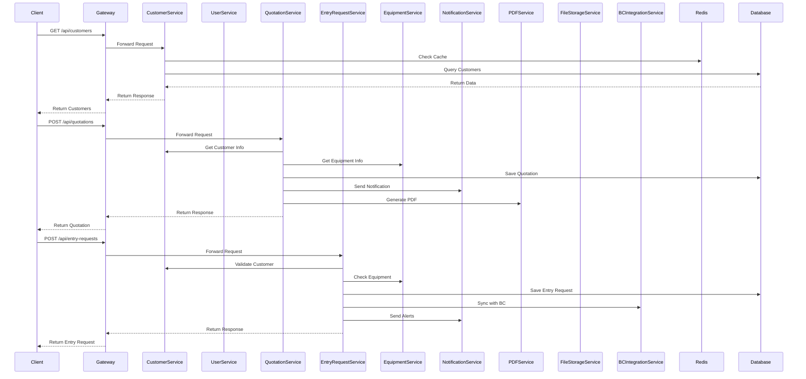
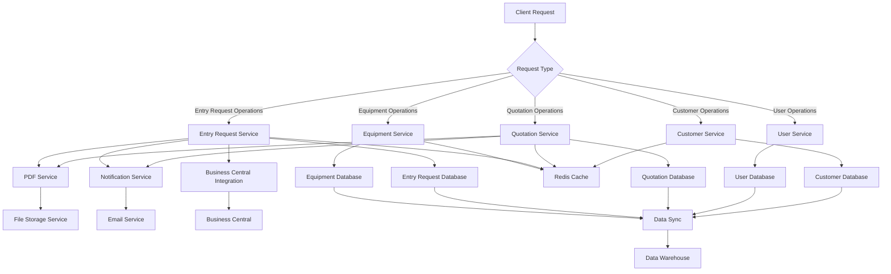
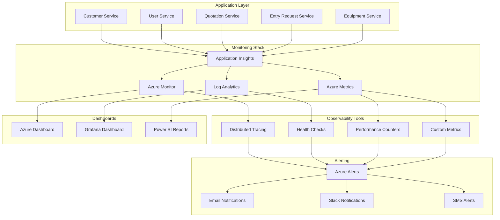
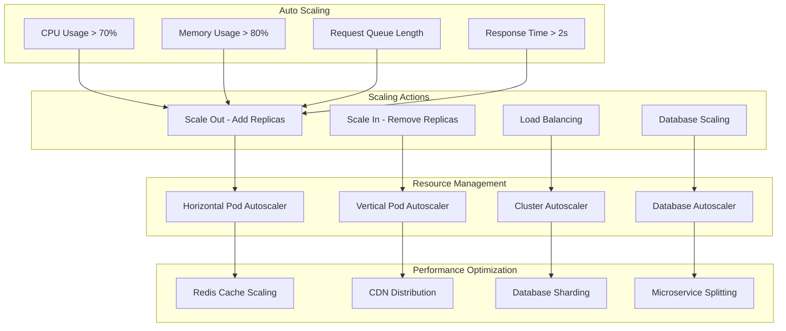
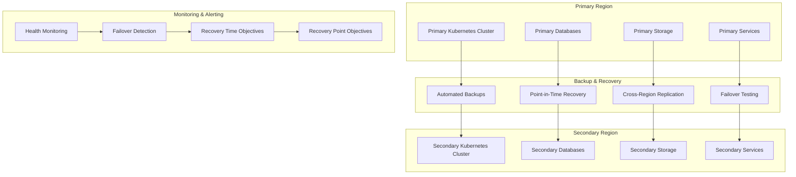

# Arquitectura Completa de Microservicios - DimmedAPI

## 1. Diagrama General de Arquitectura

## 2. Diagrama de Comunicación entre Servicios

## 3. Diagrama de Base de Datos Distribuida

```mermaid
erDiagram
    subgraph "Customer Service Database"
        CUSTOMER {
            int id PK
            string name
            string identification
            string email
            string phone
            string mobile
            boolean isActive
            datetime createdAt
            datetime updatedAt
            string systemIdBc
            int customerTypeId FK
        }
        CUSTOMER_ADDRESS {
            int id PK
            int customerId FK
            string address
            string city
            string state
            string postalCode
            string country
            boolean isDefault
            datetime createdAt
        }
        CUSTOMER_CONTACT {
            int id PK
            int customerId FK
            string name
            string position
            string email
            string phone
            string mobile
            boolean isActive
            datetime createdAt
        }
        CUSTOMER_TYPE {
            int id PK
            string name
            string description
            boolean isActive
            datetime createdAt
        }
    end

    subgraph "User Service Database"
        USERS {
            int id PK
            string username
            string email
            string firstName
            string lastName
            string phone
            string mobile
            boolean isActive
            datetime createdAt
            datetime updatedAt
            datetime lastLoginAt
            int profileId FK
        }
        PROFILE {
            int id PK
            string name
            string description
            boolean isActive
            datetime createdAt
        }
        BRANCH {
            int id PK
            string name
            string address
            string city
            string state
            string phone
            boolean isActive
            datetime createdAt
        }
        USER_BRANCH {
            int id PK
            int userId FK
            int branchId FK
            boolean isDefault
            datetime createdAt
        }
    end

    subgraph "Quotation Service Database"
        QUOTATION_MASTER {
            int id PK
            string quotationNumber
            int customerId
            int userId
            datetime quotationDate
            decimal totalAmount
            string status
            boolean isActive
            datetime createdAt
            datetime updatedAt
        }
        QUOTATION_DETAIL {
            int id PK
            int quotationId FK
            int equipmentId
            int quantity
            decimal unitPrice
            decimal totalPrice
            string description
        }
        QUOTATION_TYPE {
            int id PK
            string name
            string description
            boolean isActive
        }
    end

    subgraph "Entry Request Service Database"
        ENTRY_REQUESTS {
            int id PK
            string requestNumber
            int customerId
            int userId
            datetime requestDate
            string status
            string priority
            string description
            boolean isActive
            datetime createdAt
            datetime updatedAt
        }
        ENTRY_REQUEST_DETAILS {
            int id PK
            int entryRequestId FK
            int equipmentId
            int quantity
            string description
            string specifications
        }
        ENTRY_REQUEST_COMPONENTS {
            int id PK
            int entryRequestId FK
            int componentId
            int quantity
            string description
        }
    end

    subgraph "Equipment Service Database"
        EQUIPMENT {
            int id PK
            string equipmentCode
            string name
            string description
            string category
            string manufacturer
            string model
            decimal price
            boolean isActive
            datetime createdAt
            datetime updatedAt
        }
        EQUIPMENT_VIEW {
            int id PK
            string equipmentCode
            string name
            string category
            string manufacturer
            decimal price
            int stockQuantity
        }
    end

    CUSTOMER ||--o{ CUSTOMER_ADDRESS : has
    CUSTOMER ||--o{ CUSTOMER_CONTACT : has
    CUSTOMER }o--|| CUSTOMER_TYPE : belongs_to
    USERS }o--|| PROFILE : has
    USERS ||--o{ USER_BRANCH : assigned_to
    BRANCH ||--o{ USER_BRANCH : has_users
    QUOTATION_MASTER ||--o{ QUOTATION_DETAIL : contains
    QUOTATION_MASTER }o--|| QUOTATION_TYPE : has_type
    ENTRY_REQUESTS ||--o{ ENTRY_REQUEST_DETAILS : contains
    ENTRY_REQUESTS ||--o{ ENTRY_REQUEST_COMPONENTS : has_components
```

## 4. Diagrama de Despliegue en Kubernetes

```mermaid
graph TB
    subgraph "Kubernetes Cluster"
        subgraph "Namespace: dimmed-microservices"
            subgraph "API Gateway"
                AG[API Gateway<br/>Replicas: 3<br/>Port: 80]
            end
            
            subgraph "Business Services"
                CS[Customer Service<br/>Replicas: 2<br/>Port: 5001]
                QS[Quotation Service<br/>Replicas: 2<br/>Port: 5003]
                ERS[Entry Request Service<br/>Replicas: 3<br/>Port: 5004]
                ES[Equipment Service<br/>Replicas: 2<br/>Port: 5005]
            end
            
            subgraph "Infrastructure Services"
                US[User Service<br/>Replicas: 2<br/>Port: 5002]
                NS[Notification Service<br/>Replicas: 2<br/>Port: 5006]
                PS[PDF Service<br/>Replicas: 2<br/>Port: 5007]
                FSS[File Storage Service<br/>Replicas: 2<br/>Port: 5008]
                BCIS[BC Integration Service<br/>Replicas: 1<br/>Port: 5009]
            end
            
            subgraph "Databases"
                CDB[Customer DB<br/>StatefulSet]
                UDB[User DB<br/>StatefulSet]
                QDB[Quotation DB<br/>StatefulSet]
                ERDB[Entry Request DB<br/>StatefulSet]
                EDB[Equipment DB<br/>StatefulSet]
            end
            
            subgraph "Infrastructure"
                RC[Redis Cache<br/>StatefulSet]
                SB[Service Bus<br/>Deployment]
                LB[Load Balancer<br/>Service]
            end
        end
    end
    
    subgraph "External Services"
        BC[Business Central]
        AAD[Azure AD]
        ABS[Azure Blob Storage]
    end
    
    AG --> CS
    AG --> QS
    AG --> ERS
    AG --> ES
    AG --> US
    AG --> NS
    AG --> PS
    AG --> FSS
    AG --> BCIS
    
    CS --> CDB
    US --> UDB
    QS --> QDB
    ERS --> ERDB
    ES --> EDB
    
    CS --> RC
    QS --> RC
    ERS --> RC
    ES --> RC
    US --> RC
    
    BCIS --> BC
    US --> AAD
    PS --> ABS
    FSS --> ABS
```

## 5. Diagrama de Flujo de Datos

## 6. Diagrama de Monitoreo y Observabilidad

## 7. Diagrama de Seguridad

```mermaid
graph TB
    subgraph "Security Layer"
        A[Azure AD B2C]
        B[JWT Tokens]
        C[API Keys]
        D[Rate Limiting]
        E[IP Whitelisting]
    end
    
    subgraph "Network Security"
        F[Azure Firewall]
        G[Network Security Groups]
        H[Private Endpoints]
        I[VPN Gateway]
    end
    
    subgraph "Data Security"
        J[Encryption at Rest]
        K[Encryption in Transit]
        L[Key Vault]
        M[Managed Identities]
    end
    
    subgraph "Application Security"
        N[Input Validation]
        O[SQL Injection Prevention]
        P[XSS Protection]
        Q[CSRF Protection]
    end
    
    subgraph "Compliance"
        R[GDPR Compliance]
        S[SOX Compliance]
        T[ISO 27001]
        U[Audit Logging]
    end
    
    A --> B
    B --> C
    C --> D
    D --> E
    
    F --> G
    G --> H
    H --> I
    
    J --> K
    K --> L
    L --> M
    
    N --> O
    O --> P
    P --> Q
    
    R --> S
    S --> T
    T --> U
```

## 8. Diagrama de CI/CD Pipeline

```mermaid
graph LR
    subgraph "Source Control"
        A[Git Repository]
        B[Feature Branch]
        C[Main Branch]
    end
    
    subgraph "Build Pipeline"
        D[Azure DevOps]
        E[Build Agent]
        F[Unit Tests]
        G[Integration Tests]
        H[Code Quality]
    end
    
    subgraph "Artifact Management"
        I[Docker Images]
        J[Azure Container Registry]
        K[Helm Charts]
    end
    
    subgraph "Deployment"
        L[Development Environment]
        M[Staging Environment]
        N[Production Environment]
    end
    
    subgraph "Monitoring"
        O[Health Checks]
        P[Performance Monitoring]
        Q[Error Tracking]
    end
    
    A --> B
    B --> C
    C --> D
    D --> E
    E --> F
    F --> G
    G --> H
    H --> I
    I --> J
    J --> K
    K --> L
    L --> M
    M --> N
    N --> O
    O --> P
    P --> Q
```

## 9. Diagrama de Escalabilidad

## 10. Diagrama de Disaster Recovery

Estos diagramas proporcionan una visión completa de la arquitectura de microservicios, incluyendo la comunicación entre servicios, la estructura de base de datos, el despliegue, la seguridad, el monitoreo y la escalabilidad.
